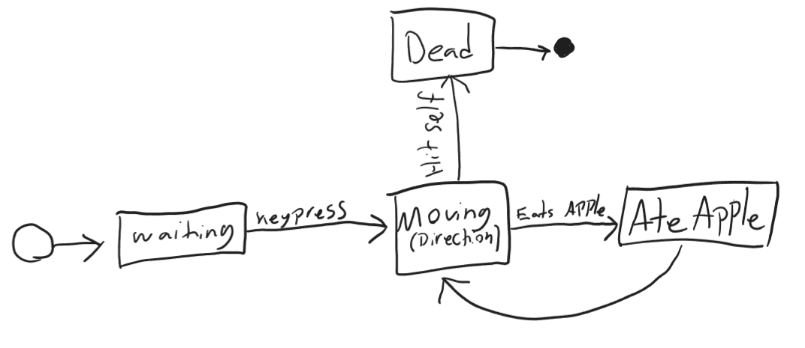
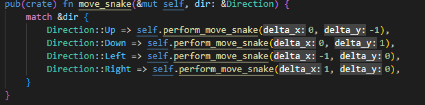

# Test Assignemnt 4
## 1. Mockito Powerups
**Answer the following questions about Mockito. Use code examples in your explanations.**

* **How do you verify that a mock was called?**
  * Using the verify() function.
  * 
* **How do you verify that a mock was NOT called?**
  * Pass the never() function as a second argument to the verify() function.
  * 
* **How do you specify how many times a mock should have been called?**
  * Using the VerificationModeFactory.times() function. Pass the amount of times the mock should have been called.
  * 
* **How do you verify that a mock was called with specific arguments?**
  * Using the verify() function. Pass the argument that you want to verify was passed.
  * 
* **How do you use a predicate to verify the properties of the arguments given to a call to the mock?**
  * Use the argThat() function, and pass it a lambda function that compares the properties of the arguments.
  * 

## 2. Snake Game
Snake game has been implemented in Rust. You can play it either by running the snake_game.exe, or if you prefer to compile it yourself:
1. Install [Rustup](https://www.rust-lang.org/tools/install) (contains everything needed for Rust, including compiler and the package manager Cargo)
2. Navigate to snake_game directory and run the following command:
   1. cargo run

### Code documentation
Credit to [SLMT](https://github.com/SLMT/rust-snake) for the rendering code which was used as a base for the development of this project!

#### lib.rs
Main package of the game library. Provides play_game() function for running the game. 

##### Game object

##### State
Rust's power lies in its guarantee of correctness. The language is designed in a way that allows it to catch at compile-time the most common issues that usually lead to crashes. To take full advantage of this, the game is designed around state-machines. 

The game initializes in the state Waiting, where nothing happens until a key is pressed, at which point it transitions to the Moving state. The moving state holds a direction, which is just an enum of either "up, down, left, right."
If an apple is eaten, the state is set to AteApple, in which the snake grows, and a new apple is spawned. After that the state is transitioned back to moving.
If the snake hits itself, the state is set to Dead. At current time the game will close immediately after entering Dead state.

##### The Game Loop

The above code is the game loop. The first if-statement checks if event.press_args() has detected a keypress. If it has, handle_keypress is called on the game-object. See below.

Next we draw the game. How this works is beyond the scope of this assignment. 

Last we update the game-logic with the update function, and pass the delta-time to the function. Delta time is the time since the last update.

##### Update function

The update function is just a match (switch/case) on the state. The function takes the time since the last update as argument. The snake only moves if the interval since the last move is less than 0.

###### Respawning the apple

This function generates a new location for the apple. It does so by first generating a position, and then checking if the location intersects with the snake. If it does, we generate a new location until it doesn't intersect with the snake.

Note here at the final line of generate_random_apple_location that if we don't add a semicolon (;) to the end of a line in Rust, we return the value. So "return (x,y);" is the same as "(x,y)".

###### Handle Keypress

The following two functions handle keypresses. First we match on the key that was pressed, to check if it was a WASD key or an arrow. If not, we just return. Then we save the resulting direction in the dir variable, which we pass to update_move_dir().

update_move_dir() checks if the new direction is the opposite of the previous. If it is, we return, since that would kill the snake. We then transition to the Moving state with the new direction, but only if the current state is either Moving or Waiting. 

#### snake.rs

##### SnakeObject

The snake is made up of a LinkedList of Blocks, which is just an x and y coordinate. 

##### Moving the Snake

The snake is moved with the move_snake method. It performs a match on the direction, and calls the private method perform_move_snake() with the delta-x and y.

The perfrom move calls the function calculate_next_position() with the current position of the snake head. Moving works by popping the tail-elemtn of the LinkedList and pushing a new block to the target position.

calculate_next_position() then adds the delta-x and y to the current position, and checks if the position is outside the bounds of the game. If it is, the position is wrapped.

##### Checking Collision

The check_collision method makes a clone of the snake body, and removes its head. Otherwise the snake would constantly collide with its head.

From this function we return a Collision type, which is either a Snake, Apple or None collision, based on what the snake head collides with.

The intersects_body function loops through the Blocks in the snake body and checks if they overlap with the given position of the head. This function is also used in the generate_random_apple_location function to check if the apple overlaps with the body of the snake. 

##### Growing the snake
[!Snake Grow](images/code/snake-grow.png)
This function pushes a new Block onto the back of the body-LinkedList, with the same position as the previous tail Block. 
